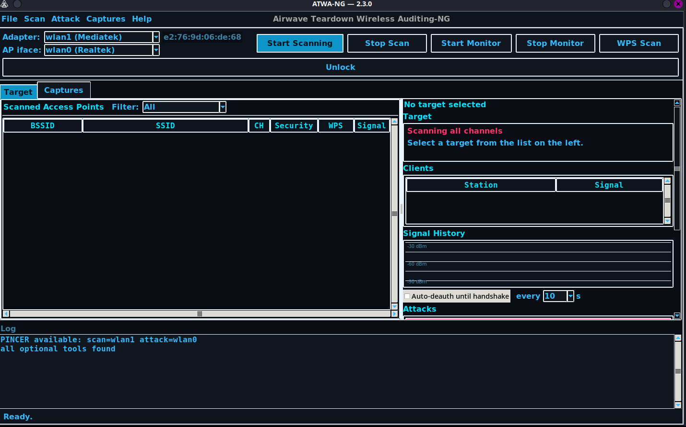

**Para español, haz clic [aquí](./README_ES.md)**

<p align="center">
  
</p>

<p align="center">
  
  &nbsp;&nbsp;&nbsp;
  
  &nbsp;&nbsp;&nbsp;
  
</p>

<p align="center">
  <b>One WiFi tool. Two radios. Zero mercy for a weak password.</b>
</p>

<p align="center">
  
  
  
  
</p>

---

## N2-NG just got REVAMPED. 🔥

Same mission, brand new engine. **ATWA-NG** is the next generation — faster, sharper, and it does something N2-NG never could: run two radios at once. Full changelog's in the code; the short version is **everything hits harder now.**

The last stable N2-NG release stays right where it is — see [Releases](../../releases) for the full history and the legacy `n2-ng` branch.

---

## The last WiFi pentesting tool you'll need

Every other tool makes you choose: scan *or* attack. Listen *or* strike. One radio, doing one job, badly, at the same time. You've felt it — the scan stutters the second you fire a deauth, the handshake capture drops a frame because your only adapter just got yanked onto another channel to send a packet. That's not a workflow. That's a compromise dressed up as software.

ATWA-NG doesn't compromise. It listens with one radio and strikes with the other — simultaneously, natively, no time-sharing, no dropped frames. Every attack in this tool — PMKID, handshake capture, WPS, WEP, Evil Twin — runs on a real, from-scratch implementation, not a shell wrapper hoping a subprocess doesn't crash. You get one interface, real feedback, and captures you can actually trust the second they land on disk.

If you've ever lost a handshake because your one adapter blinked at the wrong moment — this is the tool that ends that.

---

## 🚩 Flagship: PINCER — Dual-WiFi Attack

**This is the feature nothing else has.**

Requires two Alfa adapters — an **AWUS036ACHM** (listener) and an **AWUS1900** (attacker), auto-detected by chipset. Plug both in. Lock a target. Hit **PINCER**. From that instant:

- **Radio A never stops listening.** Parked on the target's channel, ears open, waiting for the handshake — full-time, not squeezed in between other jobs.
- **Radio B never stops hammering.** Continuous deauth rounds against the target, full-time, on its own separate channel-lock.

Neither radio ever pauses, hops, or time-shares to do the other one's job. That's the whole trick, and it's the reason PINCER catches handshakes single-adapter attacks miss: the listener is *always* listening exactly when the deauth actually lands. Two adapters, two jobs, zero compromise — a real pincer, closing from both sides at once.

---

## Everything else in the box

| Attack | What it actually does |
|---|---|
| **Smart Attack** | Auto-routes: PMKID first, falls back to deauth+handshake if the target's clientless-immune |
| **OMNI Attack** | Full adaptive chain — profile → PMKID → handshake → online guess → crack, one click |
| **PMKID (clientless)** | No client needed. Native scapy, PMF-aware |
| **Handshake Capture** | Native EAPOL sniff with an AUTHORIZED-vs-challenge-only verification gate — no more guessing if what you caught is actually crackable |
| **WPS** | Null-PIN, Pixie-Dust, and Bruteforce — Bruteforce tries a free null-PIN first and bails immediately if the AP's locked, instead of burning 10,000 attempts on a dead end |
| **WEP** | Fake-auth + ARP replay + native PTW key recovery, plus Caffe Latte for client-only attacks |
| **Evil Twin** | Real rogue AP + captive portal, auto-deauths real clients toward it |
| **Online Password Guess** | Live, real per-password 4-way handshake attempts straight against the AP |
| **Cracking** | Miguel the Ripper and aircrack-ng, both wired in — one-click crack, or point it at a whole folder of captures and let it merge, convert, and crack the lot |
| **Hidden SSID de-cloaking** | Automatic, as soon as a probe response reveals it |

Every one of these is a real, native attack — not a `subprocess.run()` gamble.

---

## Using the GUI

<p align="center">
  
</p>

ATWA-NG is the first WiFi tool to put scanning and pentesting in the same window — no separate scanner, no separate attack script, no separate cracker. Launch with `atwa gui` (needs root). Here's the flow, start to finish:

- **Adapter** dropdown — pick your WiFi card, then **Start Monitor** puts it into monitor mode. A second adapter in **AP iface** unlocks PINCER or Evil Twin's rogue-AP side.
- **Start Scanning** — channel-hops and fills the **Scanned Access Points** list live: BSSID, SSID, channel, security, signal.
- **Click a target row** — locks the adapter to that AP's channel, starts the signal graph, and starts a real capture against just that AP (populates the **Clients** list too).
- **Attack** menu / button stack — Deauth, PMKID, Handshake Capture, Smart/OMNI, WEP, WPS variants, Evil Twin. **Stop Attack** ends whatever's running.
- **Captures** tab — Inspect, Convert to 22000, Fix (repair a malformed capture), Merge, Crack Selected, or the folder-wide **Crack Handshakes...** dialog: point it at a folder and a wordlist, pick a backend (**John** or **Aircrack-ng**), hit **Run**. A cracked password shows on screen and gets saved to `creds.json` right next to the capture.

Full CLI reference (16 subcommands) and a dependency checklist live in [USAGE.md](./USAGE.md).

---

## Install

```bash
git clone https://github.com/KiMiGuel/ATWA-NG.git
cd ATWA-NG
python3 -m venv .venv
source .venv/bin/activate
pip install -e .
```

**Cracking needs John the Ripper (jumbo build specifically — the `wpapsk` format isn't in the plain community edition).** On Kali it's one line and you're done:

```bash
sudo apt install john
```

Not on Kali, or your distro's `john` package isn't the jumbo build? Check first (`john --list=formats | grep -i wpapsk`), and if it's missing, build jumbo from source into `~/john` — the tool looks there automatically if `john` isn't on `PATH`:

```bash
git clone https://github.com/openwall/john -b bleeding-jumbo ~/john
cd ~/john/src && ./configure && make -s clean && make -sj$(nproc)
```

## Use it

```bash
atwa gui          # the full experience — launch the GUI (needs root)
```

Or drive it straight from the terminal:

```bash
atwa --help
atwa scan wlan0
atwa smart wlan0 <bssid>
atwa omni wlan0 <bssid> --wordlist rockyou.txt
```

**Requirements:** Linux, Python 3.10+, a WiFi adapter capable of monitor mode + injection (an AWUS036ACHM + AWUS1900 pair to unlock PINCER).

---

Need a wordlist to point this thing at? [Indepenlist-MX-wordlist](https://github.com/KiMiGuel/Indepenlist-MX-wordlist) — Mexican-focused password wordlists.

---

For authorized security testing only — against networks and devices you own or are explicitly authorized to test.

<p align="center">
  <sub>By <b>KiMiGuEL</b> — <a href="https://github.com/KiMiGuel">INDEPENTEST</a></sub>
</p>
