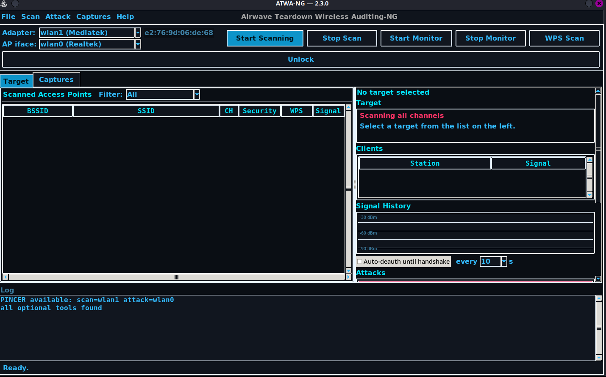

**Para español, haz clic [aquí](./README_ES.md)**

<p align="center">
  
</p>

<p align="center">
  
  &nbsp;&nbsp;&nbsp;
  
  &nbsp;&nbsp;&nbsp;
  
</p>

<h3 align="center">One WiFi tool. Two radios. Zero mercy for a weak password.</h3>

<p align="center">
  
  
  
  
  
</p>

<p align="center">
  <b>Scan · Capture · Crack — one window, one workflow.</b>
</p>

---

## 🛰️ Scan — see the whole room before you touch a thing

Passive recon that keeps up with a crowded RF environment.

| | Feature | What it does |
|---|---|---|
| 📡 | **Live AP discovery** | Channel-hopping passive scan builds the target list from real beacons and probe responses — BSSID, SSID, channel, security, signal. |
| 👻 | **Hidden SSIDs** | De-cloaked the instant a probe reveals the name. |
| 🧑🤝🧑 | **Client discovery** | Every station seen talking to a target, mapped to its AP so you know who to aim at. |
| 📶 | **Signal history** | A live graph per target as you hold it. |
| 🔐 | **Security profiling** | WPA2 / WPA3 / OWE / WPS / PMF read off the beacon, so you know what will and won't work before you fire. |
| 🦀 | **PINCER listening** | A second radio stays parked on the target while the first one attacks — no channel-sharing, no dropped frames. |

```bash
atwa scan wlan0
```

---

## 💥 Attack — pick the tool that fits the target

| | Attack | What it does |
|---|---|---|
| 🎯 | **PMKID** | **Clientless.** No client, no deauth — one auth frame and the AP hands you the PMKID. PMF-immune. |
| 🤝 | **Handshake capture** | Sniffs the 4-way and tells you whether it's actually crackable before you burn a wordlist. |
| 💥 | **Deauth** | Reason-code cycling, burst control, and a TX-power check so a silent radio doesn't look like a broken attack. |
| 🌀 | **CHAOS** | The whole flood suite against one target — beacon, EAPOL, auth, deauth, channel-steer and TKIP-MIC — escalating in tiers, reporting only what actually had an effect. |
| 🕳️ | **WEP** | Fake-auth + ARP replay + native PTW key recovery. |
| ☕ | **Caffe Latte / Hirte** | WEP straight off a client — no AP association needed. |
| 📶 | **WPS** | Pixie-Dust, Bruteforce, Null-PIN, and recon that replaces `wash`. Tries a free null-PIN first and bails if the AP is locked. |
| 🕵️ | **Downgrade Twin** | Rogue WPA2-only twin against a WPA3-transition AP. No credential portal. |
| 🛰️ | **OWE Downgrade** | Rogue open twin for OWE-transition networks. |
| 💥 | **PMF Bypass** | Malformed EAPOL that forces a reconnect on a PMF-required twin — the deauth that PMF can't block. |
| 🐉 | **Dragonblood** | SAE timing side-channel pruning (CVE-2019-9494). Unpatched pre-2.10 APs only. |
| 🔑 | **Online Guess** | Real per-password 4-way attempts straight against the AP. |

> Every attack is reachable from the CLI **and** the GUI.

---

## 🧠 The chains — when you'd rather not choose

- **OMNI** — profiles the target, then walks **PMKID → WPS → handshake → online guess → crack**, short-circuiting the moment something lands.
- **SMART** — the fast path: PMKID first, deauth+handshake fallback, stop on first success.
- **PINCER** 🦀 — two radios at once. One **listens** (parked on the target, racing for a clientless PMKID), the other **strikes** (escalating deauth: 8 → 16 → 32 → 64, aimed at the two strongest clients, riding the channel's advertised TX limit).

```bash
atwa omni wlan0 <bssid> --wordlist rockyou.txt
atwa smart wlan0 <bssid>
atwa gui     # plug in two adapters, pick a target, hit PINCER
```

> PINCER needs two detected Alfa adapters — the **AWUS036ACHM** + **AWUS1900/RTL8814AU** pair is auto-detected by chipset.

---

## 🔓 Crack — capture and crack, same window

No manual format juggling. Point it at a capture and let it run.

| | Feature | What it does |
|---|---|---|
| ⚙️ | **Two engines** | **John the Ripper (jumbo)** primary, **aircrack-ng** alternate. |
| 📁 | **Crack a whole folder** | Aim it at a directory — it merges, converts and cracks the lot unattended. |
| 🔄 | **Auto conversion** | `.cap`/`.pcap` → `22000` → John, all internal. |
| 🩹 | **Fix a capture** | Repairs a malformed pcap instead of throwing it away. |
| ✅ | **Verify first** | Tells you a handshake is usable *before* you spend a wordlist on it. |
| 💾 | **Results land** | Cracked password on screen and in `creds.json` beside the capture. |

```bash
atwa crack-cap capture.cap rockyou.txt
atwa crack hashes.22000 rockyou.txt
```

---

## Install

Linux (Kali recommended), Python 3.10+, and a WiFi adapter that supports monitor mode and packet injection. With that:

```bash
git clone https://github.com/KiMiGuel/ATWA-NG.git
cd ATWA-NG
python3 -m venv .venv && source .venv/bin/activate
pip install -e .
```

That gives you the `atwa` command. Two things worth installing alongside, both optional but you'll want them:

**John the Ripper jumbo** (for `atwa crack`) — the `wpapsk` format isn't in the community build.

```bash
sudo apt install john
john --list=formats | grep -i wpapsk    # verify

# missing it? build jumbo into ~/john and ATWA-NG finds it on its own:
git clone https://github.com/openwall/john -b bleeding-jumbo ~/john
cd ~/john/src && ./configure && make -s clean && make -sj$(nproc)
```

**hcxtools** (for capture conversion): `sudo apt install hcxtools`

There's a full dependency checklist in [USAGE.md](./USAGE.md), and the GUI can audit your system for you — **Help → Check Dependencies**.

---

## Use it

The GUI is the easiest way in — it handles monitor mode and elevation for you:

```bash
atwa gui
```

**Adapter → Start Monitor** puts the adapter in monitor mode. **Start Scanning** fills the AP list. **Click a target** to lock its channel and watch the signal graph. The **Attacks** panel below has everything: deauth, PMKID, handshake, SMART/OMNI/CHAOS, WEP, WPS, floods, rogue-APs. A second adapter unlocks PINCER and the rogue-AP workflows. The **Captures** tab is where you inspect, convert, fix, merge and crack what you caught.

Driving it from the terminal works too. The two things to know: CLI commands need root, and the interface has to be in monitor mode first (the error tells you the exact `iw` command if it isn't):

```bash
sudo iw dev wlan0 set monitor        # once per session
sudo atwa scan wlan0                 # see what's around
sudo atwa smart wlan0 <bssid>        # quick attack: PMKID, then deauth+handshake
sudo atwa omni wlan0 <bssid> --wordlist rockyou.txt   # the full chain
```

Everything you capture lands in `~/atwa-hs/<SSID>_<BSSID>/`, and cracked passwords are saved beside the capture in `creds.json` — plus on screen.

<p align="center">
  
</p>

Full CLI reference and dependency checklist: [USAGE.md](./USAGE.md).

---

Need a wordlist? [Indepenlist-MX-wordlist](https://github.com/KiMiGuel/Indepenlist-MX-wordlist) — Mexican-focused.

ATWA-NG checks GitHub Releases for updates — the GUI does it at startup without blocking, or run `atwa update`.

---

For authorized security testing only — against networks and devices you own or are explicitly authorized to test.

<p align="center">
  <sub>By <b>KiMiGuEL</b> — <a href="https://github.com/KiMiGuel">INDEPENTEST</a></sub>
</p>
